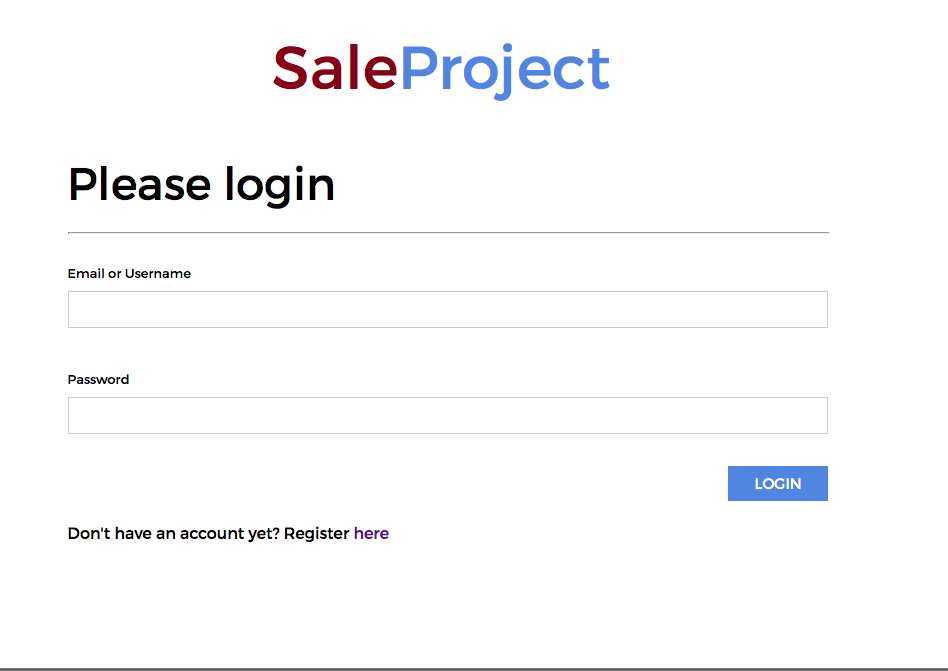
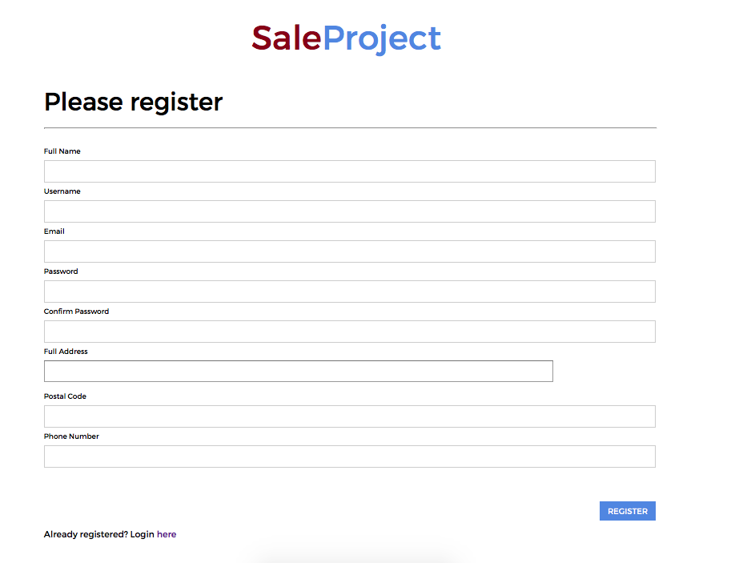
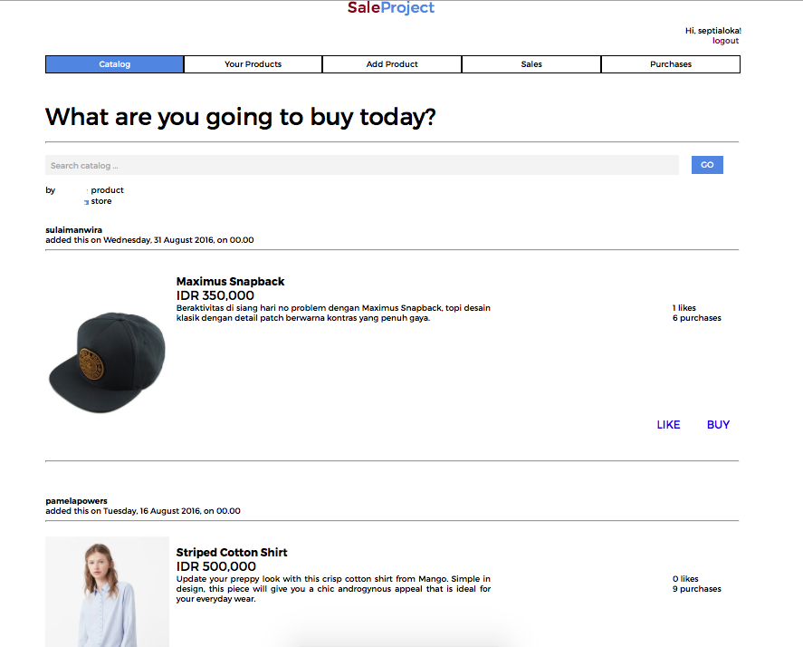
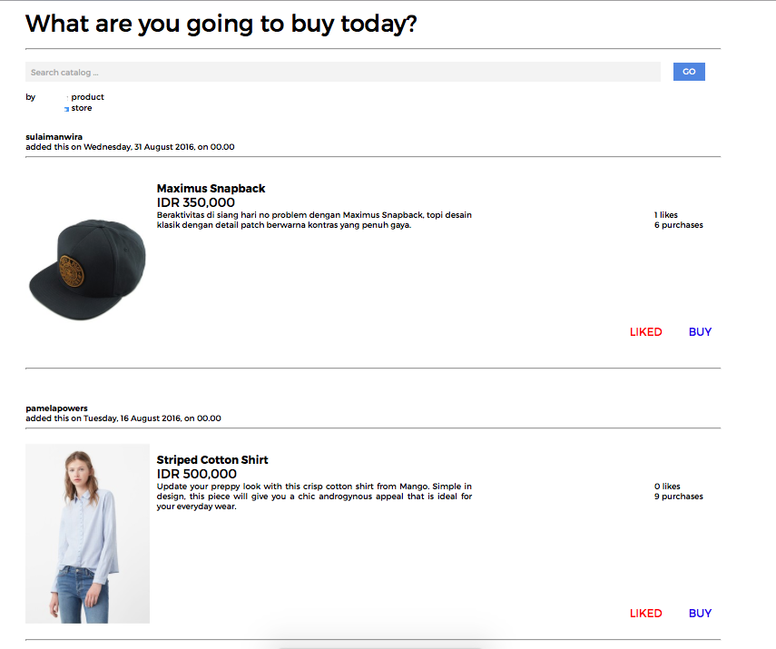
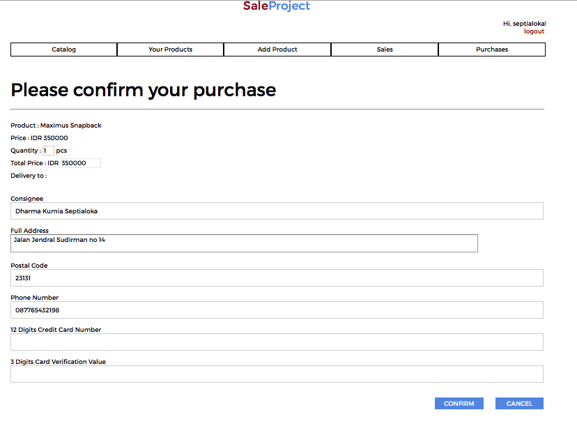
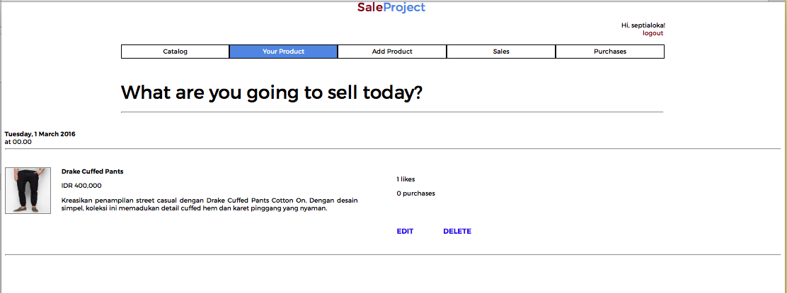
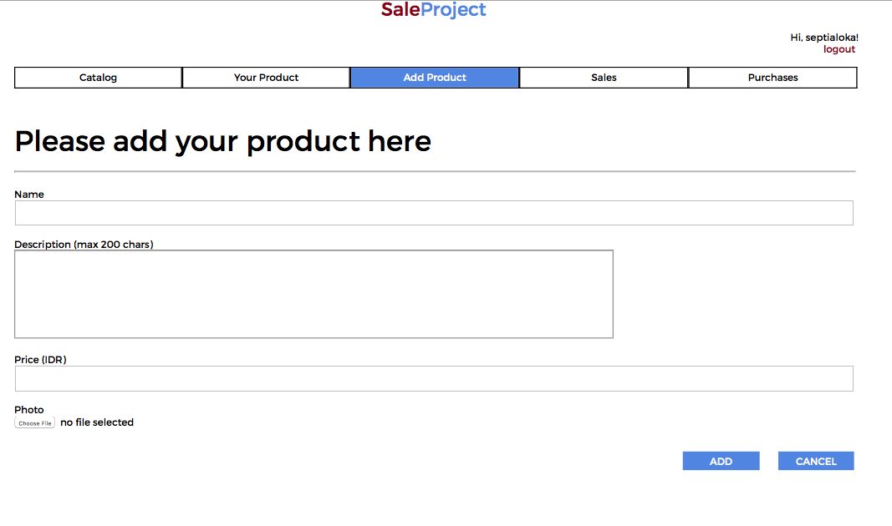
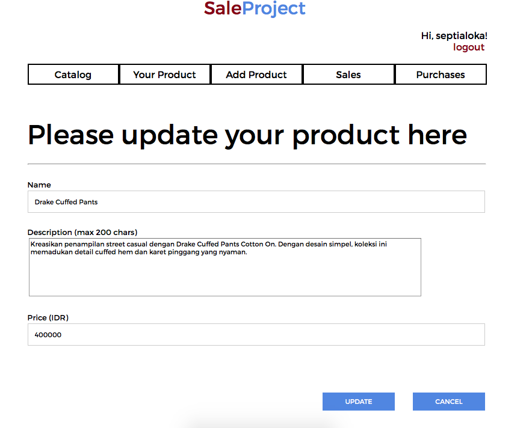
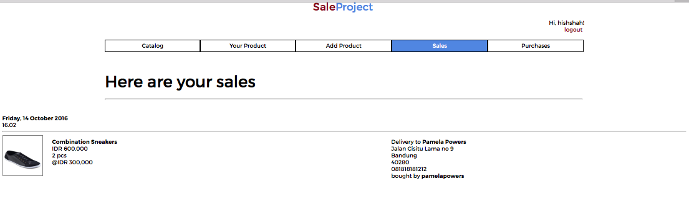
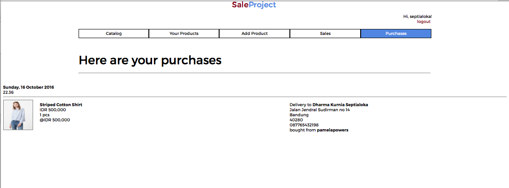

# Tugas 1 IF3110 Pengembangan Aplikasi Berbasis Web

Membuat Website Marketplace sederhana.

## Deskripsi Singkat

Tugas 1 IF3110 ini adalah tugas membuat website marketplace sederhana yang dikerjakan dengan semaksimal mungkin walaupun dikala badai tubes sedang menyerang. Pada tugas besar ini, diimplementasikan beberapa fungsi dasar web ecommerce seperti pembuatan akun, katalog, manajemen produk, pembelian produk, serta histori pembelian dan penjualan.

## Tampilan Aplikasi

### Login

Pengguna melakukan login sebagai user. Login hanya membandingkan username dan password saja, dan tidak perlu proteksi apapun. Halaman ini merupakan halaman pertama yang dibuka oleh pengguna ketika menjalankan aplikasi. Tidak ada proses otentikasi apakah pengguna sudah login atau belum dalam page lainnya. Identitas pengguna yang sedang login diberikan melalui HTTP GET pada URL (sebagai contoh: /catalog.php?id_active=2 menandakan bahwa pengguna yang sedang login memiliki id pengguna = 2).

### Register

Pengguna dapat mendaftarkan diri sebagai user agar dapat menggunakan aplikasi ini. Hanya terdapat **satu** jenis user, yaitu user yang dapat membeli sekaligus menjual barang. Setelah selesai register, otomatis masuk ke halaman Catalog dengan keadaan sudah login.

### Catalog

Catalog merupakan halaman utama yang ditampilkan ketika user telah login. Catalog menampilkan list barang yang dijual oleh seluruh pengguna. Barang-barang tersebut ditampilkan terurut dimulai dari barang yang baru ditambahkan.

Pada list barang, pengguna dapat membeli (buy) dan menyukai (like) barang. Terdapat juga informasi jumlah like dan jumlah barang tersebut yang sudah laku (purchased). Ketika pengguna menekan tombol buy, pengguna akan menuju halaman confirmation purchase.

### Confirmation Purchase

Pada halaman ini, pengguna harus mengisi identitas terkait pengiriman barang. Pada field selain credit card number, sudah terisi sesuai dengan data pengguna namun tetap dapat diubah. Untuk field quantity memiliki nilai default 1. 

### Your Products

Halaman ini berisikan list barang yang dijual oleh pengguna. Pada menu ini, pengguna dapat melakukan edit dan delete pada barang.

### Add Product

Pengguna dapat menambahkan barang yang ingin dijual. 

### Edit Product

Pengguna dapat mengubah info barang yang sudah dibuat. Form yang digunakan memiliki tampilan yang sama dengan form untuk add product, namun field-field yang ada sudah terisi. 

### Sales

Halaman ini berisi histori penjualan barang yang dijual oleh pengguna. Apabila data barang tersebut diubah/dihapus, tidak mempengaruhi histori (tetap seperti pada data ketika dilakukan pembelian).

### Purchases

Halaman ini berisi histori pembelian barang oleh pengguna. Apabila data barang tersebut diubah/dihapus, tidak mempengaruhi histori (tetap seperti pada data ketika dilakukan pembelian).

## Anggota Tim

Nama Kelompok   : Wakasta
Anggota         : 13513016 Raka Nurul Fikri
                  13514028 Dharma Kurnia Septialoka
                  13514056 Hishshah Ghassani

### Pembagian Tugas

**Tampilan**
1. Login            : 13514028
2. Register         : 13514028
3. Catalog      : 13513016
4. Your Product         : 13514056
5. Add Product          : 13514056
6. Edit Product         : 13514056
7. Sales            : 13514028
8. Purchases    : 13513016
9. Confirmation : 13513016
10. Global CSS  : 13513016

**Fungsionalitas**
1. Login            : 13514028
2. Register         : 13514028
3. Catalog      : 13513016
4. Your Product         : 13514056
5. Add Product          : 13514056
6. Edit Product         : 13514056
7. Sales            : 13514028
8. Purchases    : 13513016
9. Confirmation : 13513016

## About

Asisten IF3110 2016

Adin | Chairuni | David | Natan | Nilta | Tifani | Wawan | William

Dosen : Yudistira Dwi Wardhana | Riza Satria Perdana

